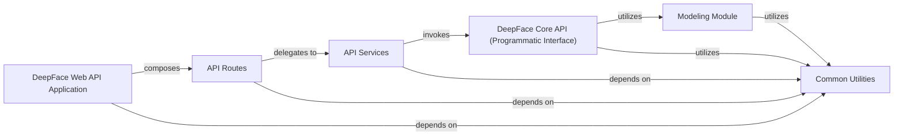

## Details

This component serves as the primary interface for users to interact with the DeepFace library, encompassing both a direct Python API for programmatic access and a web API for web-based requests. It is responsible for receiving initial user requests and orchestrating their delegation to the appropriate core processing modules.

### DeepFace Core API (Programmatic Interface)
This component provides the high-level Python API (`deepface.DeepFace`) for direct programmatic interaction with the DeepFace library. It acts as a facade, exposing a comprehensive set of face-related operations (e.g., `verify`, `analyze`, `find`, `represent`). Its primary responsibility is to orchestrate calls to specialized internal modules for core processing, offering a simplified and unified entry point for developers.

**Related Classes/Methods**:

- <a href="https://github.com/CodeBoarding/deepface/blob/master//deepface/DeepFace.py#L1-L1" target="_blank" rel="noopener noreferrer">`deepface.DeepFace` (1:1)</a>

### DeepFace Web API Application
This component represents the main FastAPI application (`deepface.api.src.app`) that serves as the entry point for web-based requests to the DeepFace library. It is responsible for initializing the API server, registering the defined API routes, and managing the overall web server setup.

**Related Classes/Methods**:

- <a href="https://github.com/CodeBoarding/deepface/blob/master//deepface/api/src/app.py#L1-L1" target="_blank" rel="noopener noreferrer">`deepface.api.src.app` (1:1)</a>

### API Routes
This component (`deepface.api.src.modules.core.routes`) defines the various HTTP endpoints (routes) for the DeepFace web API. It receives incoming web requests, parses the request body to extract necessary data (e.g., image files, parameters), and then delegates the actual processing to the `API Services` component.

**Related Classes/Methods**:

- <a href="https://github.com/CodeBoarding/deepface/blob/master//deepface/api/src/modules/core/routes.py#L1-L1" target="_blank" rel="noopener noreferrer">`deepface.api.src.modules.core.routes` (1:1)</a>

### API Services
This component (`deepface.api.src.modules.core.service`) acts as a business logic layer for the DeepFace web API. It receives requests from `API Routes`, performs necessary pre-processing, validation, or error handling specific to the API context, and then invokes the appropriate methods of the `DeepFace Core API` to perform the actual face analysis operations.

**Related Classes/Methods**:

- <a href="https://github.com/CodeBoarding/deepface/blob/master//deepface/api/src/modules/core/service.py#L1-L1" target="_blank" rel="noopener noreferrer">`deepface.api.src.modules.core.service` (1:1)</a>

### Modeling Module
This module (`deepface.modules.modeling`) is responsible for the creation and management of various deep learning models (e.g., VGG-Face, Facenet) required for different face processing tasks. It acts as a factory, providing instances of the appropriate models based on configuration or request. It is fundamental because all face analysis operations rely on these models.

**Related Classes/Methods**:

- <a href="https://github.com/CodeBoarding/deepface/blob/master//deepface/modules/modeling.py#L1-L1" target="_blank" rel="noopener noreferrer">`deepface.modules.modeling` (1:1)</a>

### Common Utilities
This component (`deepface.commons`) contains shared functionalities and helper functions utilized across various modules of the DeepFace library. This includes logging mechanisms, image loading/saving utilities, and functions for managing model weights. It is fundamental as it provides essential support for various operations across the API and core modules.

**Related Classes/Methods**:

- `deepface.commons` (1:1)

### [FAQ](https://github.com/CodeBoarding/GeneratedOnBoardings/tree/main?tab=readme-ov-file#faq)
