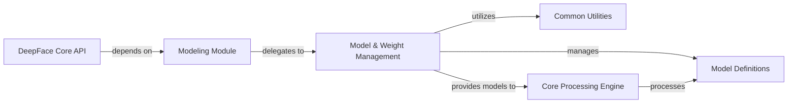

## Details

Component overview for Model & Weight Management

### Model & Weight Management [[Expand]](./Model_Weight_Management.md)
This component is responsible for the dynamic loading, building, caching, and management of various pre-trained deep learning models and their associated weights. It ensures that the necessary models and their parameters are available to the Core Processing Engine when required, optimizing performance by avoiding redundant model loading.

**Related Classes/Methods**:

- <a href="https://github.com/CodeBoarding/deepface/blob/master//deepface/modules/modeling.py#L1-L9999" target="_blank" rel="noopener noreferrer">`deepface.modules.modeling` (1:9999)</a>
- <a href="https://github.com/CodeBoarding/deepface/blob/master//deepface/commons/weight_utils.py#L1-L9999" target="_blank" rel="noopener noreferrer">`deepface.commons.weight_utils` (1:9999)</a>

### Model Definitions
Defines the abstract structure and concrete implementations of all deep learning models used in DeepFace, including base classes for facial recognition, detection, and demography models, as well as their specific client implementations (e.g., ArcFace, YOLO, Age).

**Related Classes/Methods**:

- <a href="https://github.com/CodeBoarding/deepface/blob/master//deepface/models/Demography.py#L15-L67" target="_blank" rel="noopener noreferrer">`deepface.models.Demography` (15:67)</a>
- <a href="https://github.com/CodeBoarding/deepface/blob/master//deepface/models/Detector.py#L9-L27" target="_blank" rel="noopener noreferrer">`deepface.models.Detector` (9:27)</a>
- <a href="https://github.com/CodeBoarding/deepface/blob/master//deepface/models/FacialRecognition.py#L15-L47" target="_blank" rel="noopener noreferrer">`deepface.models.FacialRecognition` (15:47)</a>
- <a href="https://github.com/CodeBoarding/deepface/blob/master//deepface/models/facial_recognition/ArcFace.py#L1-L9999" target="_blank" rel="noopener noreferrer">`deepface.models.facial_recognition.ArcFace` (1:9999)</a>
- <a href="https://github.com/CodeBoarding/deepface/blob/master//deepface/models/face_detection/Yolo.py#L1-L9999" target="_blank" rel="noopener noreferrer">`deepface.models.face_detection.Yolo` (1:9999)</a>

### Modeling Module
A sub-component acting as the primary interface for building and retrieving model instances. It provides a simplified API for other parts of the system to request specific models without needing to know the underlying loading and caching mechanisms.

**Related Classes/Methods**:

- <a href="https://github.com/CodeBoarding/deepface/blob/master//deepface/modules/modeling.py#L32-L104" target="_blank" rel="noopener noreferrer">`deepface.modules.modeling:build_model` (32:104)</a>

### Common Utilities
Provides essential utility functions for logging, file system operations (like folder management for weights), and package-related tasks, supporting various components across the DeepFace library.

**Related Classes/Methods**:

- <a href="https://github.com/CodeBoarding/deepface/blob/master//deepface/commons/logger.py#L1-L9999" target="_blank" rel="noopener noreferrer">`deepface.commons.logger` (1:9999)</a>
- <a href="https://github.com/CodeBoarding/deepface/blob/master//deepface/commons/folder_utils.py#L1-L9999" target="_blank" rel="noopener noreferrer">`deepface.commons.folder_utils` (1:9999)</a>
- <a href="https://github.com/CodeBoarding/deepface/blob/master//deepface/commons/package_utils.py#L1-L9999" target="_blank" rel="noopener noreferrer">`deepface.commons.package_utils` (1:9999)</a>

### DeepFace Core API
The central API of DeepFace, orchestrating various modules for comprehensive face analysis tasks. It serves as the main entry point for users to interact with the DeepFace library, coordinating the flow from input to output.

**Related Classes/Methods**:

- <a href="https://github.com/CodeBoarding/deepface/blob/master//deepface/DeepFace.py#L1-L9999" target="_blank" rel="noopener noreferrer">`deepface.DeepFace` (1:9999)</a>

### Core Processing Engine [[Expand]](./Core_Processing_Engine.md)
The component responsible for executing deep learning models and processing their outputs for various face analysis tasks, such as facial recognition, detection, and demography analysis. It consumes the loaded models and performs the actual inference.

**Related Classes/Methods**: _None_

### [FAQ](https://github.com/CodeBoarding/GeneratedOnBoardings/tree/main?tab=readme-ov-file#faq)
